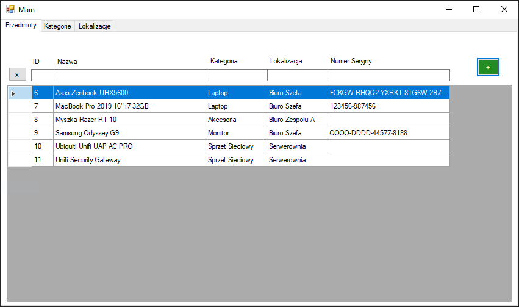
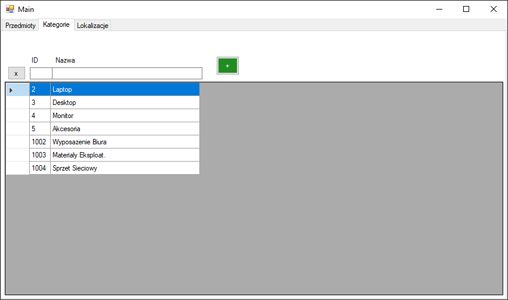
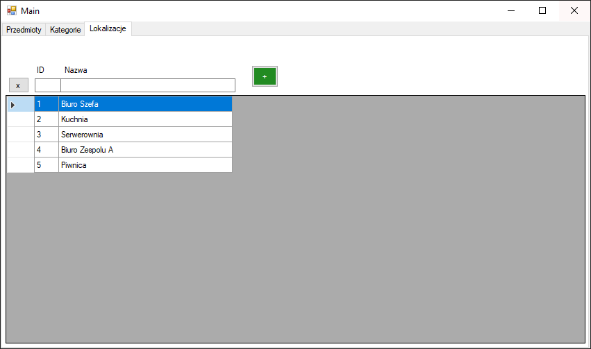
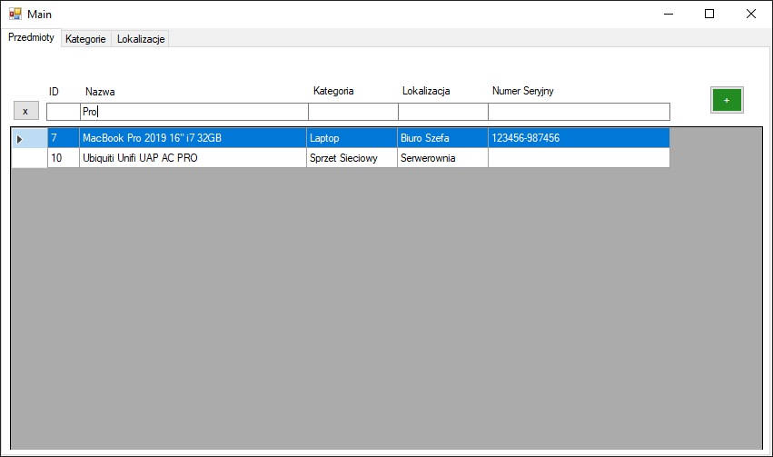
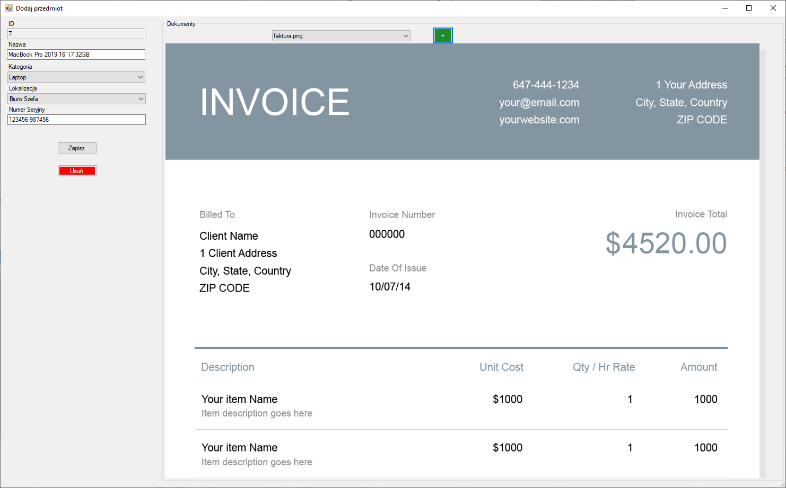
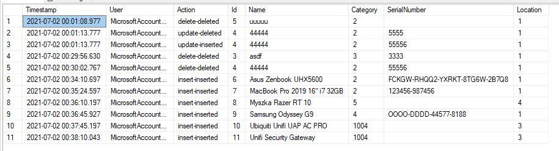

# Inventory
## Bezpieczeństwo sieci komputerowych BM

## Pomysł na aplikację

Aplikacja ma za zadanie przechowywać informacje na temat zakupionego sprzętu biurowego w niewielkiej firmie. Pozwala ona na dodawanie produktów i przypisanie ich do kategorii oraz lokalizacji (gdzie na terenie firmy ten sprzęt się znajduje). Dodatkowo aby ułatwić znalezenie dokumentów dotyczących zakupów, gwarancji itp., do każdego sprzętu można dołączyć dowolną liczbę zdjęć. Historia wszystkich zmian (dodawanie, usuwanie, modyfikacja) przedmiotów jest logowana do osobnej tabeli w bazie danych za pomocą procedur wyzwalanych. W aplikacji zaimplementowane jest wyszukiwanie po każdej możliwej właściwości danej encji, np. nazwa produktu czy kategorii.

## Uruchomienie 

Solucja składa się z 3 projektów:
`Inventory.App` - projekt WindowsForms zawierający definicję i logikę interfejsu użytkownika
`Inventory.Data` - projekt Class Library .NET Standard 2.0. Ma on za zadanie stworzyć warstwę abstrakcji pomiędzy bazą danych a resztą aplikacji. W projekcie tym znajdują się tzw. repozytoria oraz data transfer objects (DTO's).
`Inventory.Db` - projekt SQL. Znajduje się w nim projekt kompletnej bazy danych.

* W przyszłości w przypadku bardziej skomplikowanej logiki biznesowej należało by dodać jeszcze jeden projekt Class Library który by definiował właśnie tą logikę, jednak w tej chwili projekt jest bardzo prosty i nie ma takiej potrzeby.

Aby uruchomić lokalnie aplikację najpierw należy wdrożyć bazę danych. W tym celu w programie Visual Studio klikamy prawym przyciskiem myszy na projekt `Inventory.Db` a następnie `Publish`. Tworzymy nowe połączenie do serwera SQL na który chcemy zdeployować bazę i kontynuujemy.

Następnie w projekcie `Inventory.App`, w głównej klasie `Main` należy podmienić zahardcodowany connection string do bazy danych. Te dwa kroki powinny wystarczyć aby odpalić aplikację.

## Wygląd aplikacji

Zakładka produktów

Zakładka kategorii

Zakładka lokalizacji

Wyszukiwanie produktów

Edycja produktów oraz upload dokumentów

Historia zmian w tabeli `Items`

